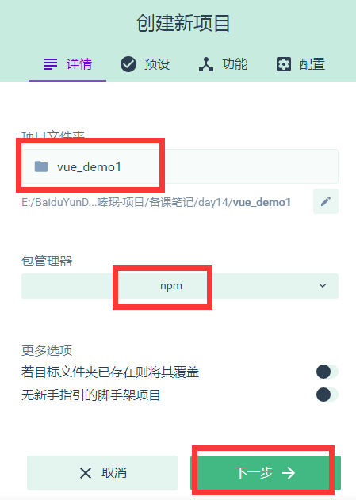
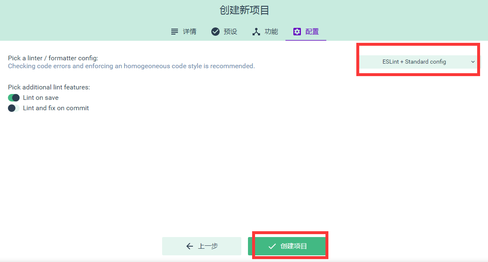

### 今日目标
1.Vuex概述

2.Vuex基本使用

3.使用Vuex完成todo案例

### 1.Vuex概述
Vuex是实现组件全局状态（数据）管理的一种机制，可以方便的实现组件之间的数据共享

使用Vuex管理数据的好处：
A.能够在vuex中集中管理共享的数据，便于开发和后期进行维护
B.能够高效的实现组件之间的数据共享，提高开发效率
C.存储在vuex中的数据是响应式的，当数据发生改变时，页面中的数据也会同步更新

### 2.Vuex的基本使用
创建带有vuex的vue项目，打开终端，输入命令：vue ui
当项目仪表盘打开之后，我们点击页面左上角的项目管理下拉列表，再点击Vue项目管理器
点击创建项目，如下图所示
第一步，设置项目名称和包管理器

第二步，设置手动配置项目

第三步，设置功能项


第四步，创建项目


### 3.使用Vuex完成计数器案例
打开刚刚创建的vuex项目，找到src目录中的App.vue组件，将代码重新编写如下：
```
<template>
  <div>
    <my-addition></my-addition>

    <p>----------------------------------------</p>

    <my-subtraction></my-subtraction>
  </div>
</template>

<script>
import Addition from './components/Addition.vue'
import Subtraction from './components/Subtraction.vue'

export default {
  data() {
    return {}
  },
  components: {
    'my-subtraction': Subtraction,
    'my-addition': Addition
  }
}
</script>

<style>
</style>
```
在components文件夹中创建Addition.vue组件，代码如下：
```
<template>
    <div>
        <h3>当前最新的count值为：</h3>
        <button>+1</button>
    </div>
</template>

<script>
export default {
  data() {
    return {}
  }
}
</script>

<style>
</style>
```
在components文件夹中创建Subtraction.vue组件，代码如下：
```
<template>
    <div>
        <h3>当前最新的count值为：</h3>
        <button>-1</button>
    </div>
</template>

<script>
export default {
  data() {
    return {}
  }
}
</script>

<style>
</style>
```
最后在项目根目录(与src平级)中创建 .prettierrc 文件，编写代码如下：
```
{
    "semi":false,
    "singleQuote":true
}
```

### 4.Vuex中的核心特性
#### A.State
    State提供唯一的公共数据源，所有共享的数据都要统一放到Store中的State中存储
    例如，打开项目中的store.js文件，在State对象中可以添加我们要共享的数据，如：count:0
    
    在组件中访问State的方式：
    1).this.$store.state.全局数据名称  如：this.$store.state.count
    2).先按需导入mapState函数： import { mapState } from 'vuex'
    然后数据映射为计算属性： computed:{ ...mapState(['全局数据名称']) }

#### B.Mutation
Mutation用于修改变更$store中的数据
使用方式：
打开store.js文件，在mutations中添加代码如下
```
mutations: {
    add(state,step){
      //第一个形参永远都是state也就是$state对象
      //第二个形参是调用add时传递的参数
      state.count+=step;
    }
  }
```
然后在Addition.vue中给按钮添加事件代码如下：
```
<button @click="Add">+1</button>

methods:{
  Add(){
    //使用commit函数调用mutations中的对应函数，
    //第一个参数就是我们要调用的mutations中的函数名
    //第二个参数就是传递给add函数的参数
    this.$store.commit('add',10)
  }
}
```

使用mutations的第二种方式：
import { mapMutations } from 'vuex'

methods:{
  ...mapMutations(['add'])
}
如下：
```
import { mapState,mapMutations } from 'vuex'

export default {
  data() {
    return {}
  },
  methods:{
      //获得mapMutations映射的sub函数
      ...mapMutations(['sub']),
      //当点击按钮时触发Sub函数
      Sub(){
          //调用sub函数完成对数据的操作
          this.sub(10);
      }
  },
  computed:{
      ...mapState(['count'])
      
  }
}
```


#### C.Action
在mutations中不能编写异步的代码，会导致vue调试器的显示出错。
在vuex中我们可以使用Action来执行异步操作。
操作步骤如下：
打开store.js文件，修改Action，如下：
```
actions: {
  addAsync(context,step){
    setTimeout(()=>{
      context.commit('add',step);
    },2000)
  }
}
```
然后在Addition.vue中给按钮添加事件代码如下：
```
<button @click="AddAsync">...+1</button>

methods:{
  AddAsync(){
    this.$store.dispatch('addAsync',5)
  }
}
```

第二种方式：
import { mapActions } from 'vuex'

methods:{
  ...mapMutations(['subAsync'])
}
如下：
```
import { mapState,mapMutations,mapActions } from 'vuex'

export default {
  data() {
    return {}
  },
  methods:{
      //获得mapMutations映射的sub函数
      ...mapMutations(['sub']),
      //当点击按钮时触发Sub函数
      Sub(){
          //调用sub函数完成对数据的操作
          this.sub(10);
      },
      //获得mapActions映射的addAsync函数
      ...mapActions(['subAsync']),
      asyncSub(){
          this.subAsync(5);
      }
  },
  computed:{
      ...mapState(['count'])
      
  }
}
```


#### D.Getter
Getter用于对Store中的数据进行加工处理形成新的数据
它只会包装Store中保存的数据，并不会修改Store中保存的数据，当Store中的数据发生变化时，Getter生成的内容也会随之变化
打开store.js文件，添加getters，如下：
```
export default new Vuex.Store({
  .......
  getters:{
    //添加了一个showNum的属性
    showNum : state =>{
      return '最新的count值为：'+state.count;
    }
  }
})
```
然后打开Addition.vue中，添加插值表达式使用getters
<h3>{{$store.getters.showNum}}</h3>

或者也可以在Addition.vue中，导入mapGetters，并将之映射为计算属性
import { mapGetters } from 'vuex'
computed:{
  ...mapGetters(['showNum'])
}

### 5.vuex案例
####  A.初始化案例
首先使用vue ui初始化一个使用vuex的案例
然后打开public文件夹，创建一个list.json文件，文件代码如下：
```
[
    {
        "id": 0,
        "info": "Racing car sprays burning fuel into crowd.",
        "done": false
    },
    {
        "id": 1,
        "info": "Japanese princess to wed commoner.",
        "done": false
    },
    {
        "id": 2,
        "info": "Australian walks 100km after outback crash.",
        "done": false
    },
    {
        "id": 3,
        "info": "Man charged over missing wedding girl.",
        "done": false
    },
    {
        "id": 4,
        "info": "Los Angeles battles huge wildfires.",
        "done": false
    }
]
```
再接着，打开main.js,添加store.js的引入，如下：
```
import Vue from 'vue'
import App from './App.vue'
import store from './store.js'

// 1. 导入 ant-design-vue 组件库
import Antd from 'ant-design-vue'
// 2. 导入组件库的样式表
import 'ant-design-vue/dist/antd.css'

Vue.config.productionTip = false
// 3. 安装组件库
Vue.use(Antd)

new Vue({
  store,
  render: h => h(App)
}).$mount('#app')
```
再接着打开store.js，添加axios请求json文件获取数据的代码，如下：
```
import Vue from 'vue'
import Vuex from 'vuex'
import axios from 'axios'

Vue.use(Vuex)

export default new Vuex.Store({
  state: {
    //所有任务列表
    list: [],
    //文本输入框中的值
    inputValue: 'AAA'
  },
  mutations: {
    initList(state, list) {
      state.list = list
    },
    setInputValue(state,value){
      state.inputValue = value
    }
  },
  actions: {
    getList(context) {
      axios.get('/list.json').then(({ data }) => {
        console.log(data);
        context.commit('initList', data)
      })
    }
  }
})
```
最后，代开App.vue文件，将store中的数据获取并展示：
```
<template>
  <div id="app">
    <a-input placeholder="请输入任务" class="my_ipt" :value="inputValue" @change="handleInputChange" />
    <a-button type="primary">添加事项</a-button>

    <a-list bordered :dataSource="list" class="dt_list">
      <a-list-item slot="renderItem" slot-scope="item">
        <!-- 复选框 -->
        <a-checkbox :checked="item.done">{{item.info}}</a-checkbox>
        <!-- 删除链接 -->
        <a slot="actions">删除</a>
      </a-list-item>

      <!-- footer区域 -->
      <div slot="footer" class="footer">
        <!-- 未完成的任务个数 -->
        <span>0条剩余</span>
        <!-- 操作按钮 -->
        <a-button-group>
          <a-button type="primary">全部</a-button>
          <a-button>未完成</a-button>
          <a-button>已完成</a-button>
        </a-button-group>
        <!-- 把已经完成的任务清空 -->
        <a>清除已完成</a>
      </div>
    </a-list>
  </div>
</template>

<script>
import { mapState } from 'vuex'

export default {
  name: 'app',
  data() {
    return {
      // list:[]
    }
  },
  created(){
    // console.log(this.$store);
    this.$store.dispatch('getList')
  },
  methods:{
    handleInputChange(e){
      // console.log(e.target.value)
      this.$store.commit('setInputValue',e.target.value)
    }
  },
  computed:{
    ...mapState(['list','inputValue'])
  }
}
</script>

<style scoped>
#app {
  padding: 10px;
}

.my_ipt {
  width: 500px;
  margin-right: 10px;
}

.dt_list {
  width: 500px;
  margin-top: 10px;
}

.footer {
  display: flex;
  justify-content: space-between;
  align-items: center;
}
</style>
```
####B.完成添加事项
首先，打开App.vue文件，给“添加事项”按钮绑定点击事件，编写处理函数
```
//绑定事件
<a-button type="primary" @click="addItemToList">添加事项</a-button>

//编写事件处理函数
methods:{
    ......
    addItemToList(){
      //向列表中新增事项
      if(this.inputValue.trim().length <= 0){
        return this.$message.warning('文本框内容不能为空')
      }

      this.$store.commit('addItem')
    }
  }
```
然后打开store.js编写addItem
```
export default new Vuex.Store({
  state: {
    //所有任务列表
    list: [],
    //文本输入框中的值
    inputValue: 'AAA',
    //下一个id
    nextId:5
  },
  mutations: {
    ........
    //添加列表项
    addItem(state){
      const obj = {
        id :state.nextId,
        info: state.inputValue.trim(),
        done:false
      }
      //将创建好的事项添加到数组list中
      state.list.push(obj)
      //将nextId值自增
      state.nextId++
      state.inputValue = ''
    }
  }
  ......
})

```

####C.完成删除事项
首先，打开App.vue文件，给“删除”按钮绑定点击事件，编写处理函数
```
//绑定事件
<a slot="actions" @click="removeItemById(item.id)">删除</a>

//编写事件处理函数
methods:{
    ......
    removeItemById(id){
      //根据id删除事项
      this.$store.commit('removeItem',id)
    }
  }
```
然后打开store.js编写addItem
```
export default new Vuex.Store({
  ......
  mutations: {
    ........
    removeItem(state,id){
      //根据id删除事项数据
      const index = state.list.findIndex( x => x.id === id )
      // console.log(index);
      if(index != -1) state.list.splice(index,1);
    }
  }
  ......
})
```

#### D.完成选中状态的改变
首先，打开App.vue文件，给“复选”按钮绑定点击事件，编写处理函数
```
//绑定事件
<a-checkbox :checked="item.done" @change="cbStateChanged(item.id,$event)">{{item.info}}</a-checkbox>

//编写事件处理函数
methods:{
    ......
    cbStateChanged(id,e){
      //复选框状态改变时触发
      const param = {
        id:id,
        status:e.target.checked
      }

      //根据id更改事项状态
      this.$store.commit('changeStatus',param)
    }
  }
```
然后打开store.js编写addItem
```
export default new Vuex.Store({
  ......
  mutations: {
    ........
    changeStatus(state,param){
      //根据id改变对应事项的状态
      const index = state.list.findIndex( x => x.id === param.id )
      if(index != -1) state.list[index].done = param.status
    }
  }
  ......
})
```

#### E.剩余项统计
打开store.js，添加getters完成剩余项统计
```
getters:{
  unDoneLength(state){
    const temp = state.list.filter( x => x.done === false )
    console.log(temp)
    return temp.length
  }
}
```
打开App.vue，使用getters展示剩余项
```
//使用映射好的计算属性展示剩余项
<!-- 未完成的任务个数 -->
<span>{{unDoneLength}}条剩余</span>

//导入getters
import { mapState,mapGetters } from 'vuex'
//映射
computed:{
  ...mapState(['list','inputValue']),
  ...mapGetters(['unDoneLength'])
}
```

#### F.清除完成事项
首先，打开App.vue文件，给“清除已完成”按钮绑定点击事件，编写处理函数
```
<!-- 把已经完成的任务清空 -->
<a @click="clean">清除已完成</a>

//编写事件处理函数
methods:{
  ......
  clean(){
    //清除已经完成的事项
    this.$store.commit('cleanDone')
  }
}
```
然后打开store.js编写addItem
```
export default new Vuex.Store({
  ......
  mutations: {
    ........
    cleanDone(state){
      state.list = state.list.filter( x => x.done === false )
    }
  }
  ......
})
```

#### G.点击选项卡切换事项
打开App.vue，给“全部”，“未完成”，“已完成”三个选项卡绑定点击事件，编写处理函数
并将列表数据来源更改为一个getters。
```
<a-list bordered :dataSource="infoList" class="dt_list">
  ......
  <!-- 操作按钮 -->
  <a-button-group>
    <a-button :type="viewKey ==='all'?'primary':'default'" @click="changeList('all')">全部</a-button>
    <a-button :type="viewKey ==='undone'?'primary':'default'" @click="changeList('undone')">未完成</a-button>
    <a-button :type="viewKey ==='done'?'primary':'default'" @click="changeList('done')">已完成</a-button>
  </a-button-group>
  ......
</a-list>

//编写事件处理函数以及映射计算属性
methods:{
  ......
  changeList( key ){
    //点击“全部”，“已完成”，“未完成”时触发
    this.$store.commit('changeKey',key)
  }
},
computed:{
  ...mapState(['list','inputValue','viewKey']),
  ...mapGetters(['unDoneLength','infoList'])
}
```

打开store.js，添加getters，mutations，state
```
export default new Vuex.Store({
  state: {
    ......
    //保存默认的选项卡值
    viewKey:'all'
  },
  mutations: {
    ......
    changeKey(state,key){
      //当用户点击“全部”，“已完成”，“未完成”选项卡时触发
      state.viewKey = key
    }
  },
  ......
  getters:{
    .......
    infoList(state){
      if(state.viewKey === 'all'){
        return state.list
      }
      if(state.viewKey === 'undone'){
        return state.list.filter( x => x.done === false )
      }
      if(state.viewKey === 'done'){
        return state.list.filter( x => x.done === true )
      }
    }
  }
})
```